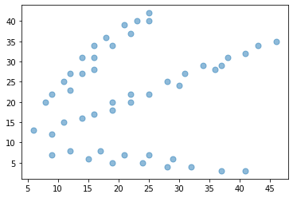
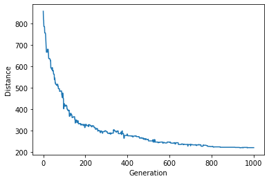

## Extension TSP for all 50 points by Genetic Algorithm


```python
import pandas as pd, random, operator, numpy as np, matplotlib.pyplot as plt, time
from sklearn.cluster import KMeans
```

Read in the provided data file 'Cluster_dataset.txt' and store in a pandas dataFrame


```python
file_txt = pd.read_csv("C:\\Users\\nobody\\Desktop\\GA_assign1_CS-AI\\Papers\\Cluster_dataset.txt", delimiter="\t",names=['colA', 'colB'])
```


```python
df = pd.DataFrame(file_txt)
"""  
kmeans = KMeans(n_clusters=3).fit(df)
centroids = kmeans.cluster_centers_
print(centroids)
gp=kmeans.labels_
df['Gp_Label'] = gp 
"""  
print(df)

plt.scatter(df['colA'], df['colB'], s=50, alpha=0.5)
#plt.scatter(centroids[:, 0], centroids[:, 1], c='red', s=50)
plt.show()
```

        colA  colB
    0     25    42
    1     23    40
    2     25    40
    3     21    39
    4     22    37
    5     18    36
    6     46    35
    7     16    34
    8     19    34
    9     43    34
    10    41    32
    11    14    31
    12    16    31
    13    38    31
    14    34    29
    15    37    29
    16    16    28
    17    36    28
    18    12    27
    19    14    27
    20    31    27
    21    11    25
    22    28    25
    23    30    24
    24    12    23
    25     9    22
    26    22    22
    27    25    22
    28     8    20
    29    19    20
    30    22    20
    31    19    18
    32    16    17
    33    14    16
    34    11    15
    35     6    13
    36     9    12
    37    12     8
    38    17     8
    39     9     7
    40    21     7
    41    25     7
    42    15     6
    43    29     6
    44    19     5
    45    24     5
    46    28     4
    47    32     4
    48    37     3
    49    41     3
    


    

    


```python
cc=[]

for i in range(0,len(df)):
    c=(df.loc[i, 'colA'],df.loc[i, 'colB'])
    cc.append(c)

```

## Genetic Algorithm for Symmetric TSP

Create class to handle "cities", ie. the 50 data points


```python
class City:
    def __init__(self, x, y):
        self.x = x
        self.y = y
    
    def distance(self, city):
        xDis = abs(self.x - city.x)
        yDis = abs(self.y - city.y)
        distance = np.sqrt((xDis ** 2) + (yDis ** 2))
        return distance
    
    def __repr__(self):
        return "(" + str(self.x) + "," + str(self.y) + ")"
```

Create a fitness function


```python
class Fitness:
    def __init__(self, route):
        self.route = route
        self.distance = 0
        self.fitness= 0.0
    
    def routeDistance(self):
        if self.distance ==0:
            pathDistance = 0
            for i in range(0, len(self.route)):
                fromCity = self.route[i]
                toCity = None
                if i + 1 < len(self.route):
                    toCity = self.route[i + 1]
                else:
                    toCity = self.route[0]
                pathDistance += fromCity.distance(toCity)
            self.distance = pathDistance
        return self.distance
    
    def routeFitness(self):
        if self.fitness == 0:
            self.fitness = 1 / float(self.routeDistance())
        return self.fitness
```

## Create the initial population

Route generator


```python
def createRoute(cityList):
    route = random.sample(cityList, len(cityList))
    return route
```

Create first "population" (list of routes) by use of Route-Generator


```python
def initialPopulation(popSize, cityList):
    population = []

    for i in range(0, popSize):
        population.append(createRoute(cityList))
    return population
```

## Create the Genetic Algorithm with Selection, Crossover and Mutation functions

Ranking routes by sorting individuals fitness score via "Fitness" function call


```python
def rankRoutes(population):
    fitnessResults = {}
    for i in range(0,len(population)):
        fitnessResults[i] = Fitness(population[i]).routeFitness()
    return sorted(fitnessResults.items(), key = operator.itemgetter(1), reverse = True)
```

## Selection - select mating pool

Create a selection function that will be used to make the list of parent routes


```python
def selection(popRanked, eliteSize):
    selectionResults = []
    df = pd.DataFrame(np.array(popRanked), columns=["Index","Fitness"])
    df['cum_sum'] = df.Fitness.cumsum()
    df['cum_perc'] = 100*df.cum_sum/df.Fitness.sum()
    
    for i in range(0, eliteSize):
        selectionResults.append(popRanked[i][0])
    for i in range(0, len(popRanked) - eliteSize):
        pick = 100*random.random()
        for i in range(0, len(popRanked)):
            if pick <= df.iat[i,3]:
                selectionResults.append(popRanked[i][0])
                break
    return selectionResults
```

Create mating pool


```python
def matingPool(population, selectionResults):
    matingpool = []
    for i in range(0, len(selectionResults)):
        index = selectionResults[i]
        matingpool.append(population[index])
    return matingpool
```

## Crossover - create offspring portion by ordered crossover

Create a crossover function for two parents to create one child


```python
def breed(parent1, parent2):
    child = []
    childP1 = []
    childP2 = []
    
    geneA = int(random.random() * len(parent1))
    geneB = int(random.random() * len(parent1))
    
    startGene = min(geneA, geneB)
    endGene = max(geneA, geneB)

    for i in range(startGene, endGene):
        childP1.append(parent1[i])
        
    childP2 = [item for item in parent2 if item not in childP1]

    child = childP1 + childP2
    return child
```

Create function to run crossover over whole mating pool to generate offspring population


```python
def breedPopulation(matingpool, eliteSize):
    children = []
    length = len(matingpool) - eliteSize
    pool = random.sample(matingpool, len(matingpool))

    for i in range(0,eliteSize):
        children.append(matingpool[i])
    
    for i in range(0, length):
        child = breed(pool[i], pool[len(matingpool)-i-1])
        children.append(child)
    return children
```

## Mutation - swapping any two cities in a route

Create function to mutate a single route


```python
def mutate(individual, mutationRate):
    for swapped in range(len(individual)):
        if(random.random() < mutationRate):
            swapWith = int(random.random() * len(individual))
            
            city1 = individual[swapped]
            city2 = individual[swapWith]
            
            individual[swapped] = city2
            individual[swapWith] = city1
    return individual
```

Create function to run mutation over entire population


```python
def mutatePopulation(population, mutationRate):
    mutatedPop = []
    
    for ind in range(0, len(population)):
        mutatedInd = mutate(population[ind], mutationRate)
        mutatedPop.append(mutatedInd)
    return mutatedPop
```

## Function to put all steps - selection, crossover and mutation together to create the next new generation


```python
def nextGeneration(currentGen, eliteSize, mutationRate):
    popRanked = rankRoutes(currentGen)
    selectionResults = selection(popRanked, eliteSize)
    matingpool = matingPool(currentGen, selectionResults)
    children = breedPopulation(matingpool, eliteSize)
    nextGeneration = mutatePopulation(children, mutationRate)
    return nextGeneration
```

## Final step: build up the genetic algorithm


```python
def geneticAlgorithm(population, popSize, eliteSize, mutationRate, generations):
    pop = initialPopulation(popSize, population)
    print("Initial distance: " + str(1 / rankRoutes(pop)[0][1]))
    
    for i in range(0, generations):
        pop = nextGeneration(pop, eliteSize, mutationRate)
    
    print("Final distance: " + str(1 / rankRoutes(pop)[0][1]))
    bestRouteIndex = rankRoutes(pop)[0][0]

    bestRoute = pop[bestRouteIndex]
    print("\nThe bestRoute is : \n",bestRoute)
    return bestRoute
```

## Plot the progress

Plot of each GA running cycle - the Distance vs Generation


```python
# run the function to see how distance has improved in each generation
def geneticAlgorithmPlot(population, popSize, eliteSize, mutationRate, generations):
    pop = initialPopulation(popSize, population)
    progress = []
    progress.append(1 / rankRoutes(pop)[0][1])
    
    for i in range(0, generations):
        pop = nextGeneration(pop, eliteSize, mutationRate)
        progress.append(1 / rankRoutes(pop)[0][1])
    
    plt.plot(progress)
    plt.ylabel('Distance')
    plt.xlabel('Generation')
    plt.show()
```

## Run the genetic algorithm


```python
cityList=[]
c_part=[]


for i in range(0,len(cc)):
    cityList.append(City(x=int(cc[i][0]), y=int(cc[i][1])))

print("\nThe starting route is :")
print(cityList)  

t0 = time.time()
geneticAlgorithm(population=cityList, popSize=100, eliteSize=20, mutationRate=0.005, generations=1000)
print('\nThis run time is:', time.time() - t0, 's')
geneticAlgorithmPlot(population=cityList, popSize=100, eliteSize=20, mutationRate=0.005, generations=1000)
```

    
    The starting route is :
    [(25,42), (23,40), (25,40), (21,39), (22,37), (18,36), (46,35), (16,34), (19,34), (43,34), (41,32), (14,31), (16,31), (38,31), (34,29), (37,29), (16,28), (36,28), (12,27), (14,27), (31,27), (11,25), (28,25), (30,24), (12,23), (9,22), (22,22), (25,22), (8,20), (19,20), (22,20), (19,18), (16,17), (14,16), (11,15), (6,13), (9,12), (12,8), (17,8), (9,7), (21,7), (25,7), (15,6), (29,6), (19,5), (24,5), (28,4), (32,4), (37,3), (41,3)]
    Initial distance: 835.4609146297641
    Final distance: 237.8016825226612
    
    The bestRoute is : 
     [(14,27), (19,34), (22,37), (21,39), (23,40), (25,42), (25,40), (18,36), (16,34), (16,31), (14,31), (16,28), (12,27), (11,25), (12,23), (9,22), (8,20), (6,13), (11,15), (12,8), (9,7), (9,12), (14,16), (16,17), (17,8), (15,6), (19,5), (24,5), (29,6), (37,3), (41,3), (32,4), (28,4), (25,7), (21,7), (19,18), (25,22), (28,25), (31,27), (36,28), (37,29), (38,31), (43,34), (46,35), (41,32), (34,29), (30,24), (22,22), (22,20), (19,20)]
    
    This run time is: 176.76290774345398 s
    


    

    


geneticAlgorithm(population=cityList, popSize=100, eliteSize=20, mutationRate=0.005, generations=1000)


```python

```
